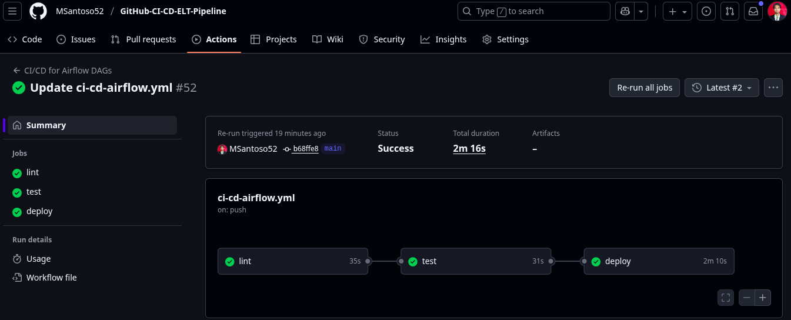

# GitHub-CI-CD-ELT-Pipeline
CI/CD for Airflow ELT Pipeline on K8S using GitHub Action
# *Overview*
Project repo to demonnstrate CI/CD workflow using GitHub Action. The project to automate build - test - deploy DAG file into Airflow under Kubernetes using Minikube. This workflow utilize CI/CD using GitHub Action push event, the workflow will automate run everytime git push event happen. This workflow will save time and ensure only pass test DAG deploy into production -- Airflow.  
# *Prerequisites*
To follow along this project need to be available on system:
- GitHub account ready
  Access [github.com](https://github.com/) and create account
  Create runner for self-hosted -- to verify code & workflow using local machine
  Create secret AIRFLOW_USER, AIRFLOW_PASSWORD, AIRFLOW_TOKEN -- to avoid exposed credenial
- Minikube installed
  ```bash
  curl -LO https://storage.googleapis.com/minikube/releases/latest/minikube-linux-amd64
  sudo install minikube-linux-amd64 /usr/local/bin/minikube
  chmod +x /usr/local/bin/minikube
  ```
- Kubectl installed
  ```bash
  curl -fsSL https://pkgs.k8s.io/core:/stable:/v1.31/deb/Release.key | sudo gpg --dearmor -o /etc/apt/keyrings/kubernetes-apt-keyring.gpg
  echo 'deb [signed-by=/etc/apt/keyrings/kubernetes-apt-keyring.gpg] https://pkgs.k8s.io/core:/stable:/v1.31/deb/ /' | sudo tee /etc/apt/sources.list.d/kubernetes.list
  sudo apt update
  sudo apt install -y kubectl
  ```
- git installed
  ```bash
  sudo apt install git
  git --version
  ```
- Vim (optional)
  ```bash
  sudo apt install vim
  vim --version
  ```
# *Project Flow*
The CI/CD jobs devide three section everyting done by ci_cd_airflow.yml:


1. lint -- Check formating with black
   ```yml
   lint:
    runs-on: self-hosted  # Use self-hosted runner for local access
    steps:
      - name: Checkout code
        uses: actions/checkout@v4
        
      - name: Verify Python version
        run: python3 --version
        
      - name: Install dependencies
        run: pip install -r requirements.txt --break-system-packages

      - name: Lint with flake8
        run: flake8 dags/ --count --show-source --statistics
   ```
2. test --  Validates DAG structure and ELT functions
   ```yml
   steps:
      - name: Checkout code
        uses: actions/checkout@v4

      - name: Verify Python version
        run: python3 --version
 
      - name: Install dependencies
        run: pip install -r requirements.txt --break-system-packages

      - name: Run tests
        run: pytest test/  # Validates DAG structure and ELT functions
   ```
3. deploy -- Deploying the DAG into minikube Airflow
   ```yaml
   name: Deploy DAG to Airflow in Minikube
        run: |
          # Verify namespace exists
          kubectl get namespace elt-pipeline || kubectl create namespace elt-pipeline
          # Get Airflow scheduler pod name with error handling
          # POD_NAME=$(kubectl get pods -n elt-pipeline -l app=airflow,component=scheduler -o jsonpath="{.items[0].metadata.name}" || echo "")
          POD_NAME=$(kubectl get pods -o jsonpath='{range .items[*]}{.metadata.name}{"\n"}{end}' | grep airflow-scheduler)
          if [ -z "$POD_NAME" ]; then
            echo "Error: No Airflow in namespace elt-pipeline"
            exit 1
          fi
          DAG_FOLDER=/opt/airflow/dags
          kubectl cp dags/elt_dag.py $POD_NAME:$DAG_FOLDER/elt_dag.py -n elt-pipeline
          kubectl exec -n elt-pipeline $POD_NAME -- airflow dags reserialize

   ```
